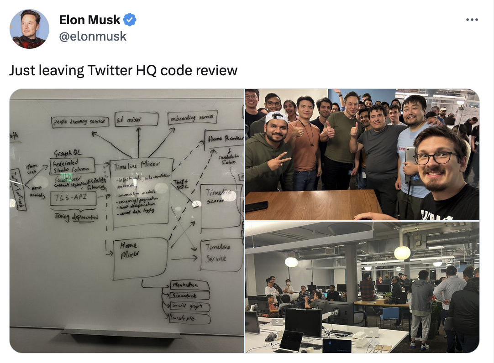
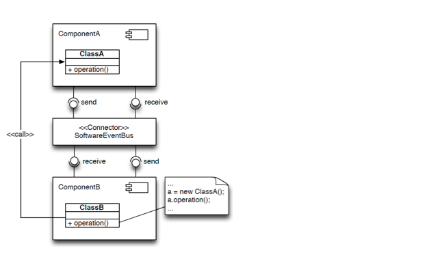
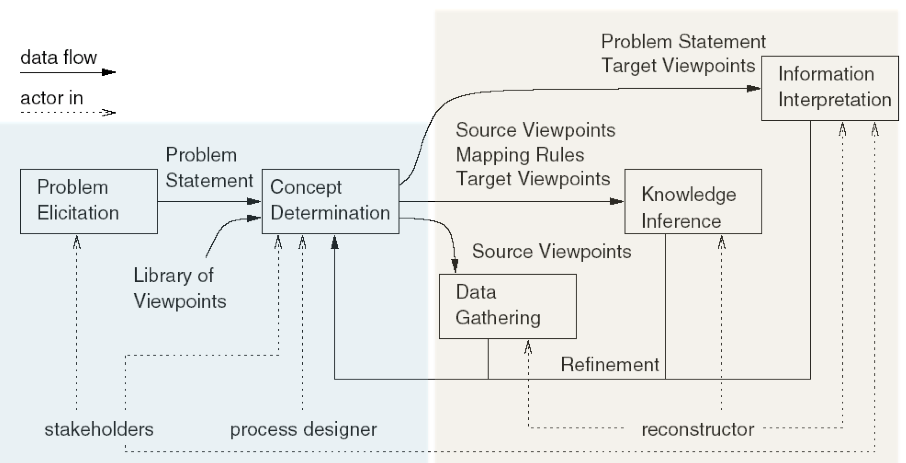

IT University of Copenhagen


# Software Architecture Recovery: Introduction

Mircea Lungu

## Intro
- *whoami*
- *whoareyou*


## Riddle

### What is the software artifact that you are not guaranteed to have, not even when paying 50B for a software company?


<details>
<summary>Answer</summary>
An up-to-date architectural diagram.
</details>


[link to original tweet](https://twitter.com/elonmusk/status/1593899029531803649)

Note: this diagram was *recovered by an outsider* and his team in a brainstorming session.

Is it accurate?
Is it still accurate today?
Is it sufficient? 


## Many Situations Require Understanding a System's Architecture

- Onboarding on a new system — where do you even start?
- Evaluating a software acquisition — what are you actually buying?
- Reviewing a change that cuts across components — will it break something?
- Conducting an architectural evaluation or a security risk assessment


## Architectural Documentation Is Rarely Available or Up to Date

### Group Discussion: Have you encountered up-to-date architectural documentation? 

*2 min in pairs, then we collect answers*

### No
*Why is it missing?*
### Yes
*Is it up to date? How? Not? Why not?*


## Few Incentives and Inherent Difficulty for Creation and Maintenance

### Rarely do stakeholders prioritize architecture documentation

- You're a startup that needs to show that the idea is viable — no time for documentation
- You're a customer that does not know about software - you want the features, the functional requirements - not the NFRs
- Often there is no perceived value for the customer (or more likely, no clear immediate value)

### Creating and maintaining it is hard
- Traceability between architecture and code is not easy to establish
- It requires a better and more general understanding of the system than just coding — not everybody can do it
- Diagrams are hard to maintain — especially when drawn in .ppt or .png


## Existing Documentation Drifts from or Contradicts Reality

Developers make decisions and changes:
- that are not aligned with the original vision => **[architectural drift](https://youtu.be/hExflmcBSc4?t=14)**
- that go against prescriptive architecture => **[architectural erosion](https://youtu.be/hExflmcBSc4?t=70)**

(Both terms from Perry & Wolf, [Foundations for the Study of Software Architecture](https://dl.acm.org/doi/10.1145/141874.141884), 1992)

|                                   | Drift                      | Erosion                        |
| --------------------------------- | -------------------------- | ------------------------------ |
| Requires documented architecture? | No                         | Yes                            |
| Nature                            | Unconscious divergence     | Violation of known constraints |
| Analogy                           | Getting lost without a map | Having a map and ignoring it   |

### Many Well-Known Systems Drifted into What They Are Today

- **Linux kernel** — **started monolithic**, gradually absorbed loadable modules, drifting toward a **hybrid kernel** through thousands of pragmatic decisions
- **WordPress** — began as a blogging engine, drifted into a **general-purpose CMS and e-commerce platform** via plugins and custom post types
- **Eclipse** — **started as a Java** IDE, drifted into a "**platform for anything**" because the plugin architecture was too flexible to constrain

### Architectural Erosion Example

The architecture prescribes communication via the EventBus, but ClassB bypasses it with a direct call to ClassA.



*2 min in pairs: If an AI agent were adding a feature to ComponentB, would it be more likely to use the EventBus or make a direct call? Why?*

### AI Agents Amplify Drift and Erosion
- An AI coding agent will continue in whatever direction the codebase is already heading
- It optimizes locally — it won't stop to ask whether the accumulation of decisions still serves a coherent whole
- This makes prescriptive architecture and architectural awareness even more important than before

## Three Responses to Architectural Decay

### Preventive: Enforce constraints so code must match architecture

Specify the architecture (draw it, formalize it), and then ensure that all new code conforms to it!

- Type systems — too low-level
- Special tools for defining architecture constraints
	- DSL - domain specific language (e.g. [Dictō](https://scg.unibe.ch/archive/papers/Cara14b-Dicto.pdf))
	- tools that take inspiration from unit testing (e.g. [ArchUnit](https://www.archunit.org/use-cases))
	- How to integrate these tools?
		- CI/CD
		- Pre-commit hooks
		- IDE
### Continuous: Generate diagrams that evolve with the code

- Declarative architecture: docker compose, infrastructure-as-code — the architecture *is* the code
- A research direction that we work on here at ITU
- This course will however, give you the tools for implementing your own evolving diagrams

### Reactive: Recover the architecture directly from code
- As opposed to *drawing them in Powerpoint* or with `draw.io`
- No great tools for this — often too much low-level noise
- **The focus of this course** (and the thesis of Babette and Lotte :)


# Architecture Recovery Is Reverse Engineering at the Architectural Level

## Reverse engineering = analyzing a system to identify its components, their interrelationships, and create representations at a higher level of abstraction. 

Introduced by Demeyer et al., [Object Oriented Reengineering Patterns](http://scg.unibe.ch/download/oorp/OORP.pdf), Chapter 1.2


## Architecture Recovery = **(def.)** A reverse engineering approach that aims at recovering viable architectural views of a software application.

Defined by Ducasse & Pollet, [Software Architecture Reconstruction: a Process-Oriented Taxonomy](https://rmod.inria.fr/archives/papers/Duca09c-TSE-SOAArchitectureExtraction.pdf)

## Architecture Recovery is a.k.a. *architecture reconstruction* 
- the literature uses both; we use *recovery* in this course


## The Symphony Process Provides a Structured Approach to Recovery

[Symphony: View-Driven Software Architecture Reconstruction](https://ipa.win.tue.nl/archive/springdays2005/Deursen1.pdf)

- Principled way
- View-driven approach
- Distinguishes between three kinds of *views*
    1. **Source**
	     - represents artifacts of a system directly
	     - not necessarily architectural (e.g. see later example)
    2. **Target**
	     - describes architecture-as-implemented
	     - e.g., module view, execution view, deployment view
    3. **Hypothetical**
	     - architecture-as-designed
	     - existing documentation, presentations


## Symphony Alternates Between Design and Execution Stages




### Problem elicitation establishes the business case
- What is the problem?


*2 min in pairs: think of a system you know — what would be the "problem elicitation" and "concept determination" for recovering its architecture?*

### Concept determination identifies needed viewpoints

- What architectural information is needed to solve the problem?
- **Which viewpoints are relevant?**


### Data gathering extracts low-level source views
 - Can involve a multitude of sources even besides source code (e.g., git repo, runtime information)


### Knowledge inference abstracts source into target views
 - Mapping low-level facts to architectural concepts (e.g., files to modules, calls to dependencies)


### Information interpretation turns views into insight
 - Visual representation of recovered views
 - Analysis, new documentation, architectural decisions


## Source Views Are Not Architectural

Example: [Google Collab with Basic Data Gathering](https://colab.research.google.com/drive/1oe_TV7936Zmmzbbgq8rzqFpxYPX7SQHP#scrollTo=0ruTtX88Tb-w)


## Measuring System Size Requires Iterative Refinement

on mac: `brew install cloc`


`cloc` (Count Lines of Code) is a useful first step in understanding a system. But raw output needs iterative refinement — a mini data gathering process in itself.

**Step 1** — Run naively:
```bash
cloc .
```
Result includes venv, caches, everything — thousands of files, meaningless numbers.

**Step 2** — Exclude obvious non-project code:
```bash
cloc --exclude-dir=venv,site-packages,__pycache__ .
```
Result: 886 files, 380k lines — but 298k of those are "Text" files, not code.

**Step 3** — Focus on the language you care about:
```bash
cloc --include-lang=Python --exclude-dir=venv,site-packages,__pycache__ .
```
Result: 560 files, ~48k lines — a much more meaningful picture.

**Step 4** — Depending on your analysis, consider excluding tests, migrations, or legacy code:
```bash
cloc --include-lang=Python --exclude-dir=venv,site-packages,__pycache__,test,old,migrations .
```

Each step is a judgment call about what counts as "the system." This is already architecture recovery thinking: deciding what's signal and what's noise.


*2 min in pairs: What are the limitations of the regex-based import extraction in the Collab? What dependencies could it miss?*

## Import Analysis Misses Many Real Dependencies

The regex approach in the Collab is a starting point, not a complete solution — it will miss aliased imports, conditional imports, re-exports, etc.

### AST = abstract syntax tree
- structured representation of a program
- throws away spaces
- throws away comments
- keeps only a data structure that represents your code
- every file will have it's AST
- every language will have a library for building ASTs
- in python it's called `ast`


### Even AST-based import analysis won't catch all dependencies

#### Transitive dependencies through method calls
You import `Bar`, but then call `Bar().baz()` which returns a `Baz` object. Your code now depends on `Baz`'s interface — if `Baz` changes, your code breaks — but your imports only mention `Bar`.
```python
from bar_module import Bar
result = Bar().baz()    # returns a Baz object
result.do_something()   # depends on Baz's interface — but we never imported it
```

#### HTTP coupling between services
In Zeeguu, the API server calls `stanza_service` for tokenization. There's no `import stanza_service` — it's an HTTP request to a URL. But if `stanza_service` goes down, the API breaks.

#### Database-mediated coupling
Service A writes to a `jobs` table, Service B polls it. Neither imports the other, but they're tightly coupled through the shared table schema.

#### Reflection and dynamic dispatch
```python
handler = getattr(module, f"handle_{event_type}")
handler(data)
```
This calls a function based on a runtime string. No static analysis will find that dependency.


# Course Roadmap

## Topics

| Week | Topic                                                                  |
| ---- | ---------------------------------------------------------------------- |
| 1    | **Introduction** — what, why, and how (today)                          |
| 2    | **Abstraction & Visualization** — from raw data to architectural views |
| 3    | **Dynamic Analysis** — observing the running system                    |
| 4    | **Evolutionary Analysis** — what version control reveals               |


## Individual Assignment


### Recover the architecture of an existing system
- Generate architectural views (e.g., module view, deployment view) from code

#### Viewpoints

1. Module Viewpoint (**default**)
	- we will write example code snippets in Collab to support this
	- makes the most sense for the Zeeguu system

2. Other Viewpoints
	- you could look at the execution or deployment information
	- might make more sense for another system — the Zeeguu one is too simple (could be done together with the module)

#### Case-Study System

1. **A system that you know** (preferred — you'll learn more analyzing something you're curious about)
	- Comparable complexity (>50k lines of code; use `cloc` to check)
	- Post your `cloc` output and initial source view on `#arch-recovery-source-views` by the next meeting
	- If you don't post by then, you'll work on Zeeguu

2. The Zeeguu Project (default)
	- [zeeguu.org](https://zeeguu.com) (invite code: zeeguu-preview)
	- Code:
		- Python Backend: [Zeeguu-API](https://github.com/zeeguu/API)
		- React Frontend: [Zeeguu-Web](https://github.com/zeeguu/web)
	- A [paper](https://github.com/zeeguu-ecosystem/CHI18-Paper/blob/master/!AsWeMayStudy--Preprint.pdf) about the system

### Alternative Goal B: Detect dead code in an existing system
- Identify code that is no longer called in production
- Requires combining static analysis (what *could* be called) with dynamic analysis (what *is* called) 
- Don't just produce a list — abstract the results (e.g., which modules are most affected? are there patterns in what became dead?)
- For Zeeguu: production endpoint data is available from [FMD](https://github.com/flask-dashboard/Flask-MonitoringDashboard)
- For other systems: **you need access to production usage data** — confirm feasibility with me

Both options:
- Document the outcome in an **individual report**
	- the target reader is a developer who needs to take over the system and maintain it
	- brief (not more than 3–5 pages)
	- do not explain what Symphony does in the report; assume the reader knows it
	- focus on your results and on explaining it to somebody that does not know the system - keep it at the level where the censor and I will understand your report 

### Tools

- Are important for recovery

- **If you can program**, this is your chance to build analysis tools over the upcoming lectures

- **If you can't program**, you'll develop expertise in evaluating and combining existing analysis tools
	- the time programmers spend coding, you'll spend finding and comparing third-party tools


# For Next Meeting

## Individual Project
- Choose a case study that you want to analyze
- Understand the code in [Google Collab with Basic Data Gathering](https://colab.research.google.com/drive/1oe_TV7936Zmmzbbgq8rzqFpxYPX7SQHP#scrollTo=0ruTtX88Tb-w)
- Create your own GH repo for your own analysis code - unless you don't know how, then you can clone the Collab and work in it
- Apply your analysis on your proposed system and post your source view together with the system size: #arch-recovery-source-views on Discord
- (Optional) Complete the implementation of the import extractor with a more precise approach than regex
	- - **If you can program**: use a real AST parser (e.g., Python's `ast` module, JavaScript's `@babel/parser`) for your project — the results will be far more reliable - it's fine to still only at imports; but at least that should be done as well as possible
	- If you're from KSD/business: regex is fine, but be aware of its limitations and document them


# Questions & Feedback
- Use the anonymous [form](https://forms.gle/ADWfDZdKfPwdFG1D6)
- Or on Discord if it's of general interest
