## Recap: ASTs for Dependency Extraction

Last time we extracted imports with regex. That works, but it's fragile — it can't tell if an import is inside a comment, a string, or a conditional block. The more robust approach is to use an **Abstract Syntax Tree** (AST).

Using the same `user.py` file from last week's Colab:

```python
import ast

source = open("zeeguu_core/model/user.py").read()
tree = ast.parse(source)

for node in ast.walk(tree):
    if isinstance(node, ast.Import):
        for alias in node.names:
            print(alias.name)
    elif isinstance(node, ast.ImportFrom):
        print(node.module)
```

Output:
```
datetime
json
random
re
sqlalchemy.orm
zeeguu_core
... 
```

Three things to remember:
- `ast.parse()` — builds the tree from source code
- `ast.walk()` — traverses every node in the tree
- `ast.Import` / `ast.ImportFrom` — the node types for `import X` and `from X import Y`

This is what you should use in your projects if you're working in Python. Other languages have equivalent libraries (e.g., `@babel/parser` for JavaScript, `tree-sitter` for multi-language support).


# The Source View from Last Lecture Is Not Yet Architectural

It reflects reality,
it conveys the message that software is complex, 
it could find a place in a modern art museum,
but it is not architectural.


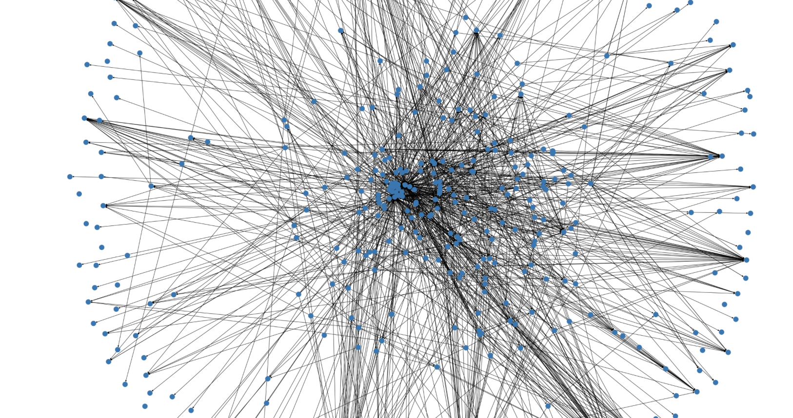

- **System**: [zeeguu/api](https://github.com/zeeguu/api) 
- **Source View**: Modules & Dependencies
- **Entities**: .py files in the project
- **Relationships**: import statements between .py files

(*Image from the [Basic Data Gathering](https://colab.research.google.com/drive/1oe_TV7936Zmmzbbgq8rzqFpxYPX7SQHP?usp=sharing) notebook*)


## We can try to simplify it

There are several ways in which we can simplify the complex graph above: 
### 1. Filtering nodes that are irrelevant

The view shows dependencies to external modules. if goal is understanding *this system's structure* ... are they needed?
	- Discuss: how to we define *external* modules?  


Interactive: [Basic Abstraction: Filtering out non-system dependencies](https://colab.research.google.com/drive/1ohvPB_SZeDa5NblzxLAkwmTY8JZRBZe_?usp=sharing). Does the graph look simpler?

**Lesson**: *filtering is an extremely useful tool in architecture recovery.*


### 2. Using more advanced graph layouts

Graph layout drawing is a [has a rich and old history](https://en.wikipedia.org/wiki/Force-directed_graph_drawing#History). 

Interactive: [Basic Abstraction: Alternative layouts with networkx](https://networkx.org/documentation/stable/reference/drawing.html) 

**Lesson**: *Advanced graph layouts can  be useful when looking at graphs but their benefits are limited; a layout can do much with a graph that is too dense and too large*. 


### Limitations of simplification

The above two methods can help but a little bit. 

It will be even less so in more complex systems. 

The solution is *abstraction*. 


# Going From Raw Dependencies to Architectural Dependencies Requires Abstraction

[Symphony...](./papers/deursen-symphony.pdf), when talking about knowledge inference (Sec. 6.2) mentions: 

> "The reconstructor creates the target view by ...
> - **condensing the low-level details** of the source view, and 
> - **abstracting them** into architectural information"


But how can we abstract this low-level source view that we have obtained? 


## Approach #1: Aggregating Entities and Relationships

### Motivational Case Study: Reflexion Models

This approach uses *"[...] domain knowledge is used to **define a map between the source and target view**."* 

> This activity may require either interviewing the system experts in order to formalize architecturally-relevant aspects not available in the implementation or to iteratively augment the source view by adding new concepts to the source viewpoint
>
> -- Symphony, 6.2


Idea introduced in [**Software Reflexion Models: Bridging the Gap between Design and Implementation**](./papers/murphy-reflexion.pdf) *Murphy et al.* which: 

- Ask Linux maintainers to 
	1. provide mappings from file names to subsystems
	2. draw dependencies between subsystems (*as-expected* architecture)


- Recover the *[as-implemented](https://youtu.be/E6N8TuqPU6o?t=30)* *module view*

- Compare the *as-implemented* architecture with the *as-expected* architecture 


#### Step 1.a. Maintainers draw dependencies between subsystems

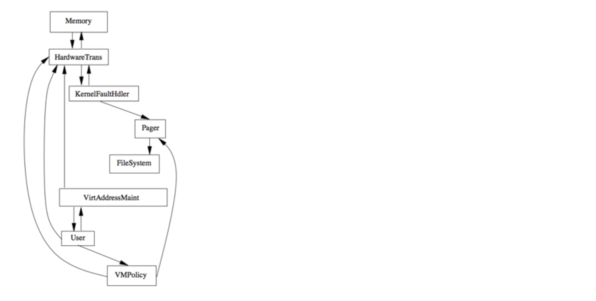

Note: All images in this section are from the [Software Reflexion Models: Bridging the Gap ...](./papers/murphy-reflexion.pdf) paper. 

#### Step 1.b. Maintainers provide mappings from file names to subsystems

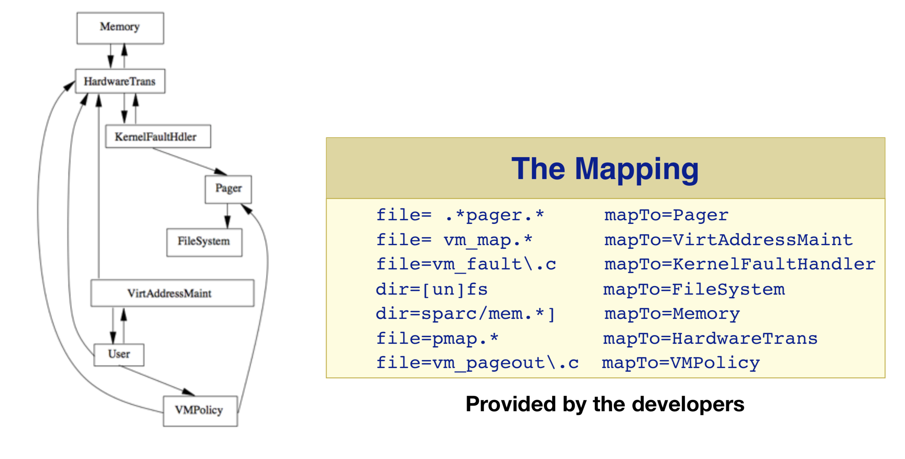

#### Step 2. Comparing the As-Implemented and the As-Expected Dependencies

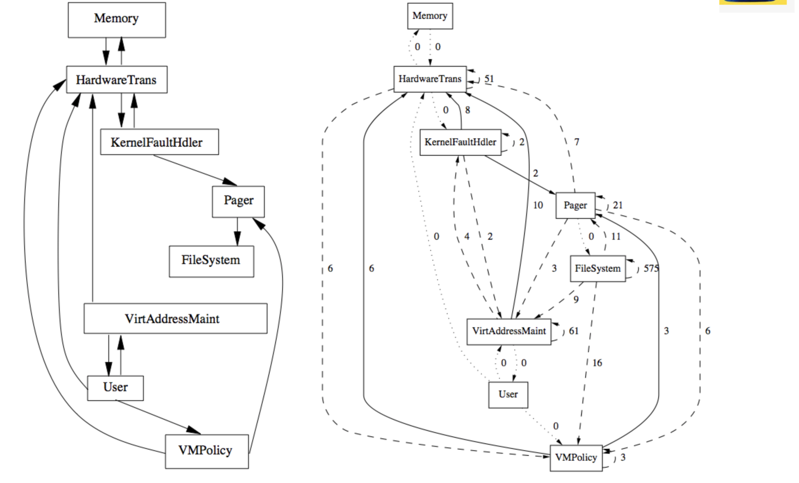

Obtaining a **reflection model** is an **iterative process**: 


```
Repeat
	1. Define/Update high-level model of interest
	2. Extract a source model
	3. Define/Update declarative mapping between high- level model and source model
	4. Reflexion model computed by system
	5. Interpret the software reflexion model
Until “happy”
```

#### A Reflexion Model Shows Where Implementation Differs from Expectation

Reflection model = (an ***architectural viewpoint*** that) indicates **where the source model and high-level model differ**

1. Convergences
2. Divergences
3. Absences


Hierarchies are powerful. We organize societies in them. And we organize software systems in them. 

### Aggregating Along the Folder Hierarchy

#### Aggregating both nodes and dependencies

Based on folder containment relationships we can: 
1. Aggregate nodes
2. Aggregate dependencies 

The following image presents a few classes and packages from the FOSS project ArgoUML


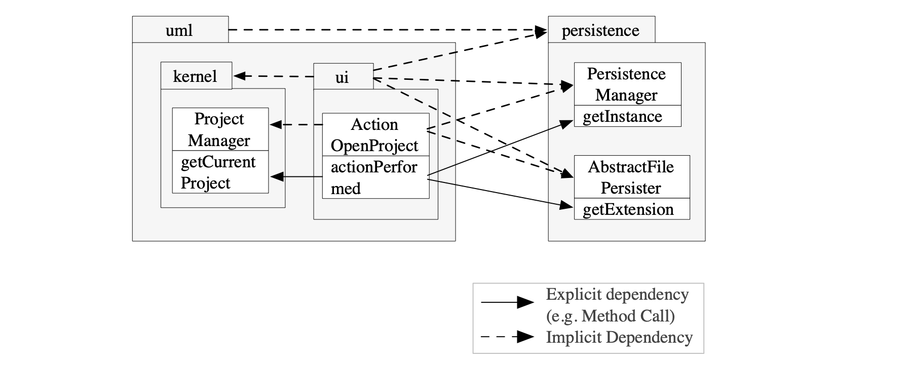

Figure shows that we can distinguish between
1. **Explicit dependencies**
	- method call
	- import
	- subclassing 
2. **Implicit aggregated dependencies** (because there are other kinds of implicit dependencies we will see next time)


Interactive: [Basic Abstraction: Exploring aggregation levels. ](https://colab.research.google.com/drive/1ohvPB_SZeDa5NblzxLAkwmTY8JZRBZe_?usp=sharing). 
- it is not clear what is the right abstraction level (e.g. depth 3? depth 2? some modules depth 1 and some depth 2)


#### Case Study: ArchLens 

For complex systems one needs to apply the *divide and conquer* approach to split the complexity of a system's architecture in multiple, more manageable perspectives.

One tool that does this is Archlens. 

```json
    "views": {
    
        "topLevel": {
             "packages": [
                {"packagePath":"", "depth":0}
            ],
            "ignorePackages": []
        },
        
	     "api-core-details": {
	        "packages": [
	            {"packagePath":"api", "depth":2},
	            {"packagePath":"core", "depth":0}
	        ],
	        "ignorePackages": ["*test*"]    
	}
```


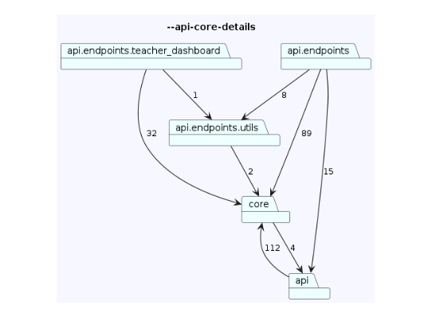

Note: If you can not program, consider trying [ArchLens](https://github.com/archlens/ArchLens) or a similar tool. In this case, given that you're not programming you'll have to spend more time explaining the recovered view. 
#### Pros and Cons of Folder-Based Aggregation

Pros: 
1. Works for many languages & systems
2. Can be used in a MSc thesis :) (e.g. [topic1](https://github.com/mircealungu/student-projects/issues/4), [topic2](https://github.com/mircealungu/student-projects/issues/35)) 

Cons:
- Some languages don't use the folder structure the same way: C# has folders vary independent from namespaces. 
- COBOL does not have a folder structure at all. Smalltalk does not even have files. 

## Approach #2: Abstracting Module Properties Using Metrics 

### Software Metrics Quantify the "Properties" in Architecture

A software [metric](https://www.javatpoint.com/software-engineering-software-metrics) is a **measure of software characteristics** which are measurable or countable

Types of metrics:
1. **Product** - measure the resulting product, e.g. source code: LOC, NOM, CYCLO of a method
2. **Process** - measure the process, e.g. frequency of change

*So how is this a complementary tool?* 

Remember the def of architecture: **"[...] modules, their properties, and the relationships between them"**.

Metrics can express these *"properties"*.

A few metrics can be computed directly on a given module: 
- number of contained files
- number of commits that involve 


### Metrics that can also be aggregated from lower-level components to modules

Almost all lower-level metrics can be aggregated.  

The only choice is: how do you aggregate? Do you sum? Do you average? It depends on the question that one is asking.

For **Files/Methods**

- **Cyclomatic Complexity** ([wiki](https://en.wikipedia.org/wiki/Cyclomatic_complexity)) 
	- number of linearly independent code paths through source code (functions of the number of branches)
	- often used in quality: too much complexity is a bad thing
	- hidden partially by polymorphism

For **Modules**
- **Size** 
	- LOC - lines of code 
	- NOM - number of methods


For **Dependencies**
- **Total count** of explicit low-level dependencies
- **Number of distinct** explicit low-level dependencies 

The way to use metrics:
- GCM = goal - question - metric approach. 


### Softwarenaut Combines Top-Down Exploration with Metrics

One approach would be an interactive top-down exploration approach combined with metrics is  Softwarenaut ([video](https://vimeo.com/62767181)) described in [Evolutionary and Collaborative Software Architecture Recovery with Softwarenaut,](https://core.ac.uk/download/pdf/33045731.pdf) by Lungu et al.

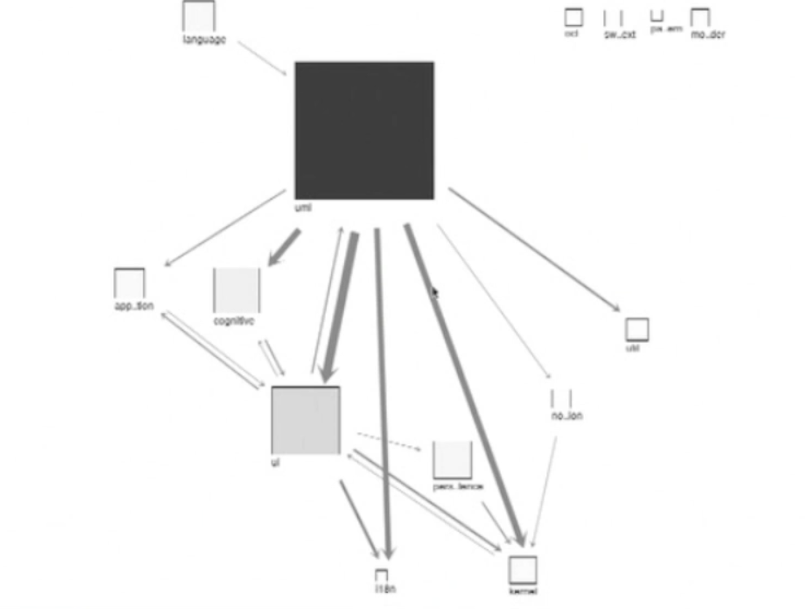
Figure: Augmeting nodes and dependencies with metrics in ArgoUML packages.

Note: you can not know upfront to what level to aggregate. So it is good to be able to explore various levels. 


## Approach #3: Network Analysis Can Identify the Most Important Elements

This approach aims to abstract the system by extracting the most important elements in it. And the importance of the elements is given yn their graph-theoretical properties. 

The `PageRank` algorithm that made Google famous tries to gauge the importance of a page in a network of pages based on the references pages make to each other. 

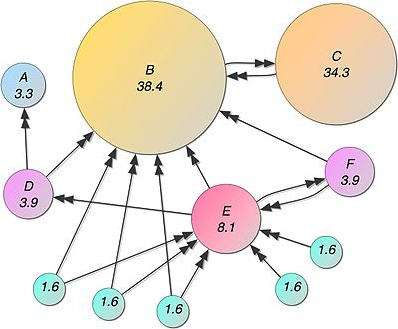
Visual intuition about PageRank ranking (Image source: [spatial-lang.org](https://spatial-lang.org/pagerank)).

In the paper [Ranking software artifacts](http://scg.unibe.ch/archive/papers/Peri10bRankingSoftware.pdf) Perin et al. applied the PR algorithm in order to attempt to detect the most relevant elements in a software system.

*Note:* Consider trying it out in your project if you're interested in network analysis! It should not be that hard, the `networkx` package supports various methods of network analysis, e.g. [centrality](https://networkx.org/documentation/stable/reference/algorithms/centrality.html#degree), [HITS](https://networkx.org/documentation/stable/reference/algorithms/generated/networkx.algorithms.link_analysis.hits_alg.hits.html), [pagerank](https://networkx.org/documentation/stable/reference/algorithms/generated/networkx.algorithms.link_analysis.pagerank_alg.pagerank.html).


## Approach #4: Automatic Clustering Still Needs Human Interpretation

What if we did unsupervised learning? We could do hierarchical clustering of the system for example. Then, we could hope that the clusters are mapped on architectural components. 

Automatic clustering has been tried with 
   - coupling and cohesion metrics
   - natural language similarity between software documents
   - other types of similarity between programming units

In all of the cases we still need human intervention to explore the result of the automatically detected clusters. 

Case study: Hierarchical Clustering. [Interactive Exploration of Semantic Clusters](papers/Interactive_Exploration_of_Semantic_Clus.pdf) by Lungu et al. 

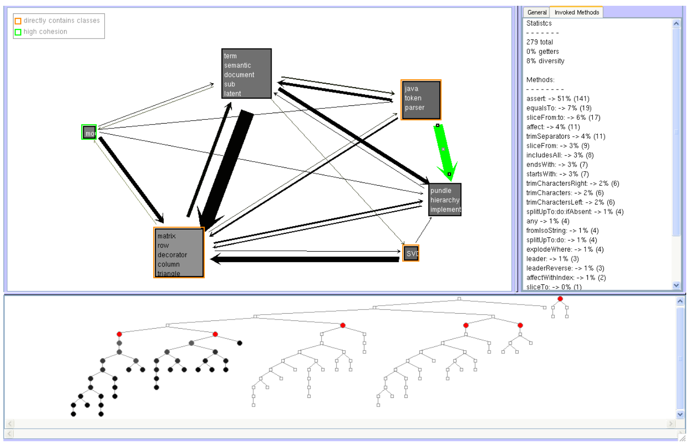


# Abstraction Alone Isn't Enough — Results Must Be Presented Effectively

We've now seen several ways to abstract a system. But abstraction alone isn't enough — the result needs to be *presented* effectively.

### Information Visualization Can Highlight the Essence of Events

[**Charles Minard**](http://t.umblr.com/redirect?z=http%3A%2F%2Fwww.edwardtufte.com%2Ftufte%2Fminard-obit&t=OTE3ZmE1M2ZiMTBiYWYwZDgwN2VlN2ZmMzhjYTI3N2JkOWM2MGY2Nyx3YWNGM3RHZQ%3D%3D)'s 1869 graph of Napoleon's 1812 march on Moscow shows the dwindling size of the army. **Tufte says that it is probably the best statistical graphic ever drawn.**

The broad line on top represents the army's size on the march from Poland to Moscow. The thin dark line below represents the army's size on the retreat. The width of the lines represents the army size, which started over 400,000 strong and dwindled to 10,000. The bottom lines are temperature and time scales, and the overall plot shows distance travelled.


A nice modern, [rerendering](https://graphworkflow.com/2019/06/25/minard/)


---

### Information Visualization Can Save Lives

In a now legendary experiment in 1854, Dr. John Snow, a London physician, conducted a simple yet brilliant test that helped to settle the debate about the transmission of cholera. Snow drew a map [see Figure 2 below] of a virulent cholera outbreak in one of the poorest neighborhoods of London – served by central wells and no sewage collection. He plotted the homes and numbers of people affected, and in a flash of insight, mapped the location of the wells that provided water for the hardest hit neighborhoods. The maps he generated and the interviews he conducted with the families of victims convinced him that the source of contamination was the water from the Broad Street well. **He received permission from local authorities to remove the pump, which forced residents to go to other, uncontaminated wells for water. Within days, the outbreak subsided**."

From: https://www.circleofblue.org/2013/world/peter-gleick-200-years-of-dr-john-snow-a-significant-figure-in-the-world-of-water/

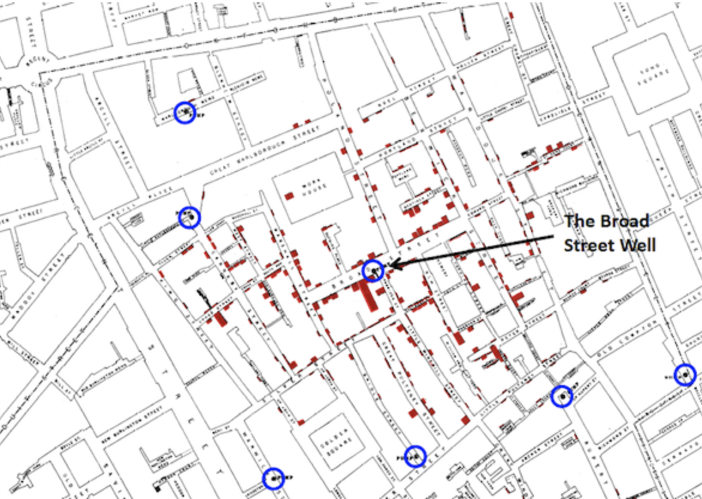

Source: *The Visual Display of Quantitative Information*, E. Tufte


---


### Tufte's Data-Ink Principles: Show the Data, Erase the Rest

*The Visual Display of Quantitative Information*, E. Tufte


Introduces: **The Five Laws of Data-Ink ([Example](https://www.codeconquest.com/blog/data-ink-ratio-explained-with-example/))**

1. Above all else, show the data
2. [Maximize Data-Ink Ratio]([Maximize Data-Ink ratio at infovis-wiki](https://infovis-wiki.net/wiki/Data-Ink_Ratio) )
3. Erase non-data ink
4. Erase redundant data ink
5. Revise and edit


## Software Visualization Applies These Principles to Code

"Software visualization techniques represent the intangible structures, interrelations, and interactions of software via visual metaphors in 2D and 3D" (Muller et al.)

Approaches touched today:
- UML
- Polymetric Views

## UML Does Not Scale

### UML does not scale well not even to 25 classes

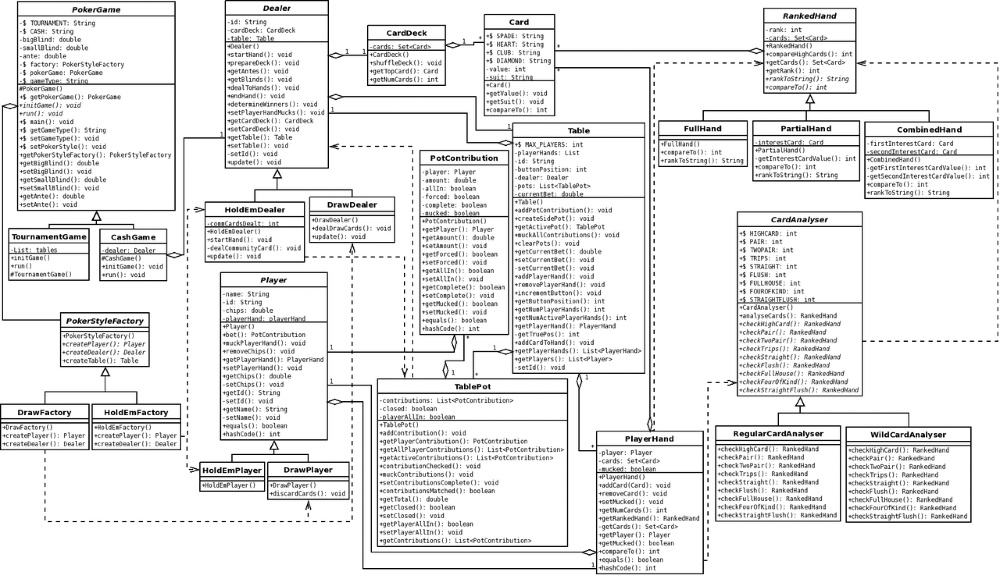

Image: Pocker Game
- 25 Classes


### It scales even worse for larger systems

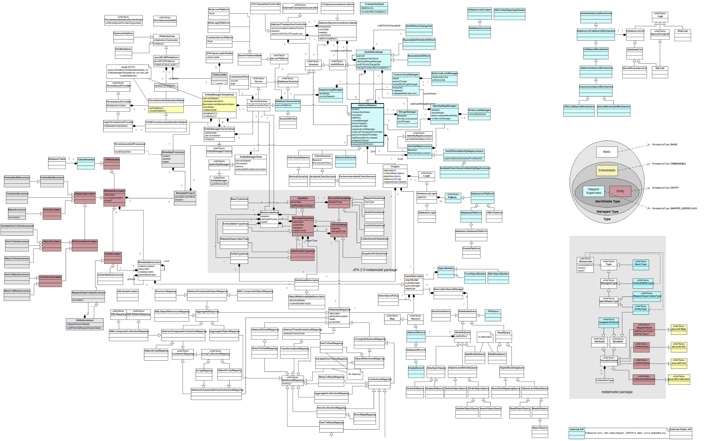

Image: Java Link API
- A persistence API
- Size: > 100 Classes


### UML Class Diagrams - Limitations

- Designed as a **modeling** language (thus for specification)
- Not used much for documentation(ArgoUML had no class diagrams about itself)


## Polymetric Views


### A Polymetric View Maps Multiple Metrics onto System Structure

**A view that visualizes multiple metrics together with system structure**

Visual properties on which to map metrics: width, height, color, edges, etc.

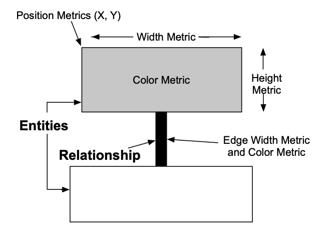

[*Polymetric Views – A Lightweight Visual Approach to Reverse Engineering*](https://rmod-files.lille.inria.fr/Team/Texts/Papers/Lanz03d-TSE-PolymetricViews.pdf) , Lanza & Ducasse


### Polymetric Views Scale to 1000+ Classes

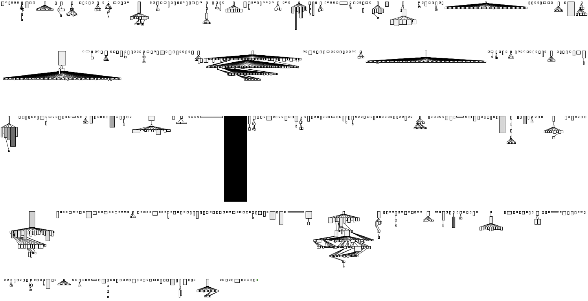

Entities: Classes: Relationships: inheritance. Height: \# of Attributes; Width: \# of Methods; Color: LOC


### Polymetric Module Views Show Dependencies Together with Metrics

**Show dependencies between modules together with multiple metrics.**
e.g. from Softwarenaut

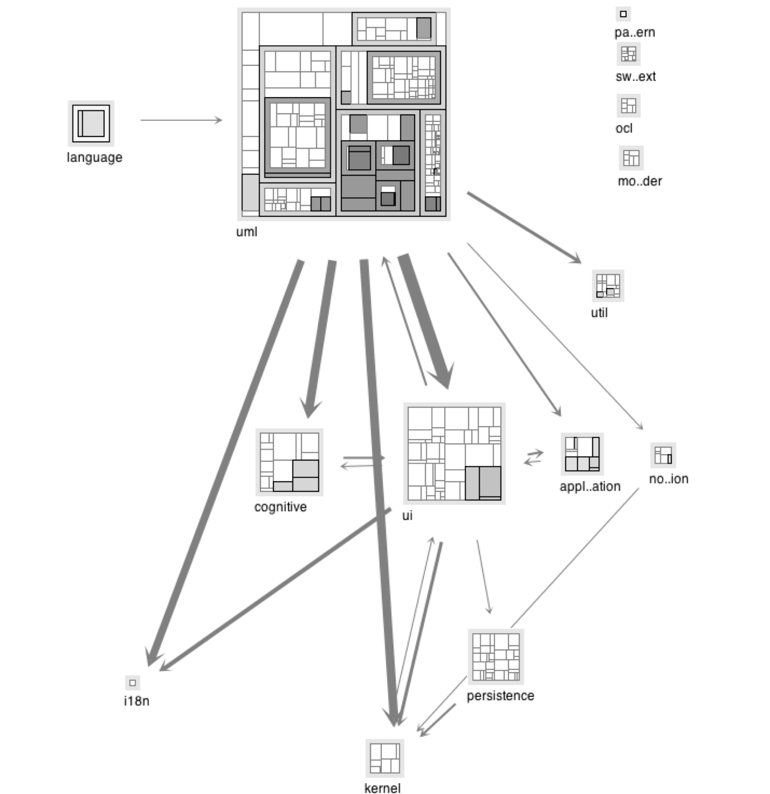

- Edge width: number of low-level method calls
- Node size: LOC
- Node figure: treemap of contents


# What We Did Today Is Reverse Engineering

**(def.)** Reverse engineering is the **process** of analyzing a subject system to **identify** the system's **components** and their **interrelationships** and create representations of the system [...] at a **higher level of abstraction**. (Demeyer et al., [Object Oriented Reengineering Patterns](http://scg.unibe.ch/download/oorp/OORP.pdf), Chapter 1.2)

Focus on
- components
- relationships
- higher level of abstraction

Architecture recovery is reverse engineering at the architectural level.

### If We Then Change the System, That's Reengineering

"Reengineering is the **examination and alteration** of a subject system to reconstitute it in a new form" (Demeyer et al., [Object Oriented Reengineering Patterns](http://scg.unibe.ch/download/oorp/OORP.pdf), Chapter 1.2)

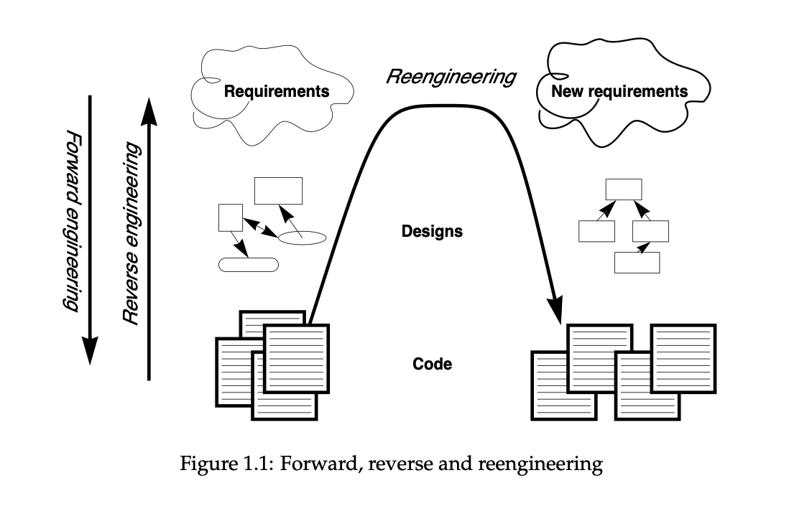

Architecture recovery could be a possible first step in reengineering.

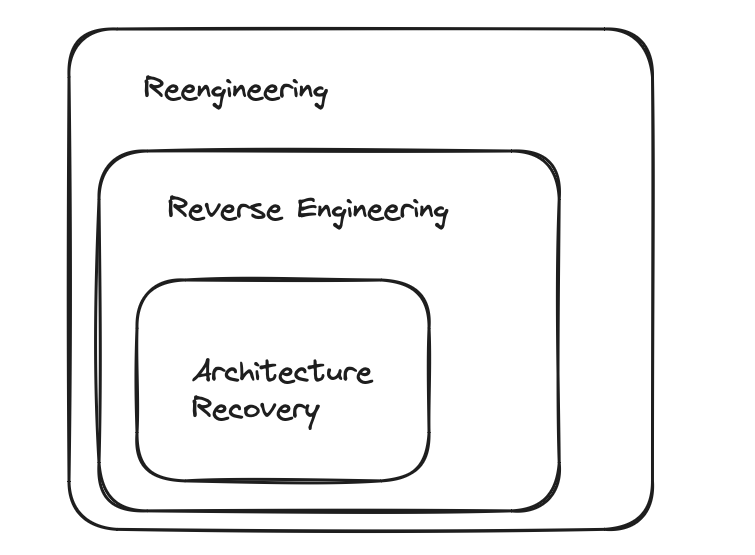

Today we went from raw data to architectural views — that was reverse engineering. If we then *change* the system based on what we learn, that's reengineering.


# Conclusion
### What you should be able to discuss

- Why are semi-automatic solutions (~*automation with human in the loop*) always required in architecture recovery?

- You have a dependency graph with 500 nodes. Which abstraction approach would you try first, and why?

- What would Tufte say about the source view from last lecture? (Think about data-ink ratio.)

- How do you explain a recovered architectural view to someone who doesn't know the system? Do you need to explain the role of the nodes? The dependencies?

### To Think About

- Are there other abstractions that we didn't discuss? What could they be?

- Could LLMs help with architecture recovery? Where in the Symphony process would they fit?

- What is the difference between a recovered view and a hand-drawn diagram on a whiteboard? Which do you trust more, and why?

### In your projects

- **By next Monday**: reply to your own source view post in `#arch-recovery-source-views` on Discord with your abstracted view. This way we can see the before and after side by side.

- Start from the dependencies extracted last time and create an abstracted module view based on aggregating entities and relationships

- Consider creating multiple complementary abstracted views if one is still too overwhelming. Or filtering.

- Do you have access to the developers such that you can recover a reflection model viewpoint of the system? There would be extra points if you did this

- Compute size metrics, and map them on the nodes in your module view

- Compute dependency metrics and map them on the edges in your graph (e.g. a stronger dependency as a thicker arrow as in the `Softwarenaut` example)

- Consider
	- using `pyvis` instead of `networkx` -- it has much nicer visualizations!
	- [exporting the data from networkx](https://networkx.github.io/documentation/stable/reference/drawing.html) into specialized graph visualization tools (e.g. cytoscape, etc.)

Note: If you spend more time implementing an analysis script or tool, you should correspondingly spend space in the report describing that. [Project Description](https://docs.google.com/document/d/10bTyUS4ZocReS3j2AxHak_-rBh_Yv_0NM6XDQrt0YkY/edit)

**Advice: Start working on your project! Don't leave it all for the last moment!**