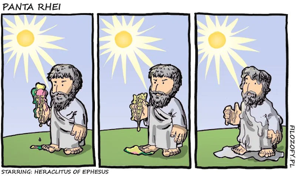
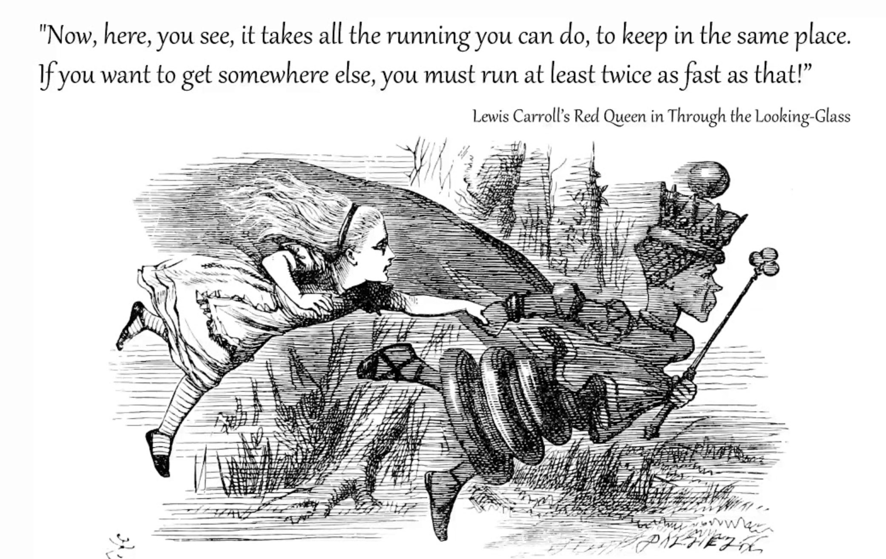
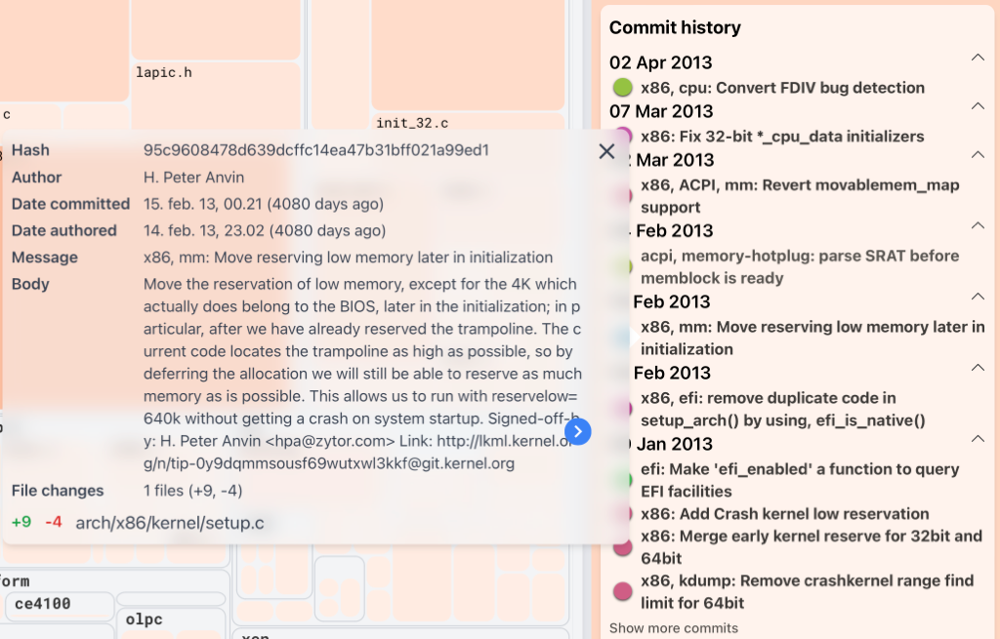
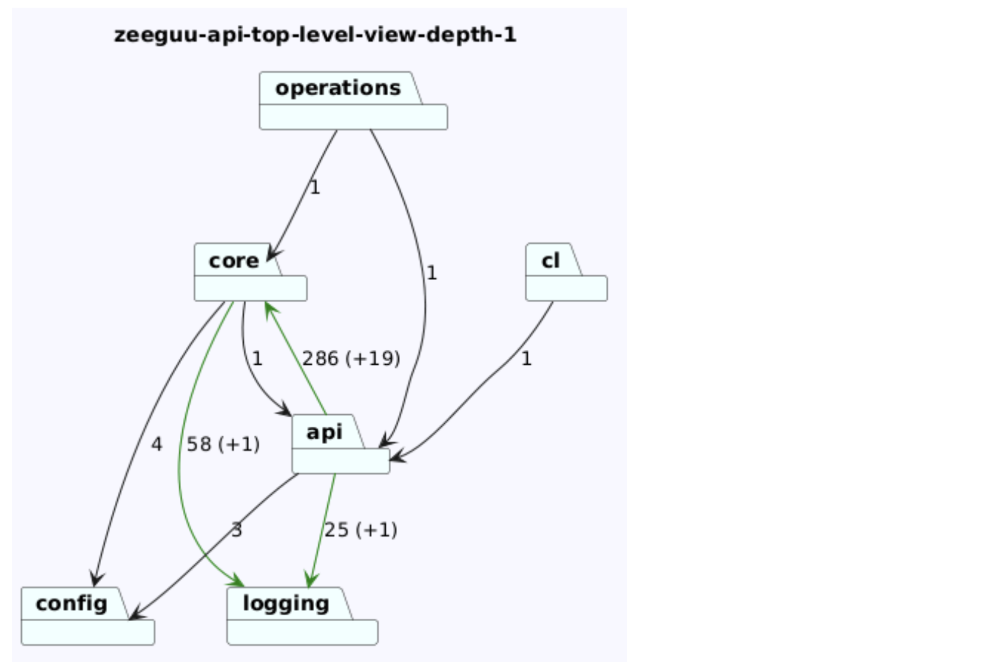

# III: Evolutionary analysis for architecture recovery

Mircea Lungu (mlun@itu.dk) 

> *No man ever steps in the same river twice, for it is not the same river and he is not the same man.*

> -- Heraclitus

*As opposed to life, in software we record the changes. Can we use them for Architecture Recovery? Can we use them for architecture evolution?* 

# Software evolution: the system is never finished

Software evolution is **the continual development of a piece of software after its initial release to address changing stakeholder requirements**.

- It used to be called *software maintenance*
- Nowadays evolution is the preferred term because it highlights the fact that a software system is never *finished*

## Why are software systems never finished? Lehman's E-type thesis

> *An e-type program that is used in a real-world environment must change, or become progressively less useful in that environment.* 
> 
> -- M. Lehman, *The Law of Continuing Change*

In the terminology of Lehman, the "e" in *e-type* stands for *embedded*. He meant, *embedded in the real world*. (A different usage than what we call now embedded systems.) Since the world changes, the system must change too.

Three forces drive the evolution of a software system: the **human context** of use, the **technical context** of the platform, and our own **evolving understanding** of the problem. 

### The human context changes: laws, taxes, regulations

To think about: *Do you have good examples of systems that had to change because the real world changed around them?* 

Examples (click to reveal)

- **Tax software** — has to track legal changes in its country every year
- **Banking systems after PSD2 (EU, 2018)** — forced to expose core banking APIs to third-party fintechs; a deep architectural overhaul of legacy cores
- **Video-conferencing at COVID onset** — Zoom went from ~10M to ~300M daily users in a few months, forcing a major re-architecture for 20×+ load
- **Mobile advertising after Apple's App Tracking Transparency (2021)** — attribution pipelines had to be rebuilt industry-wide, essentially overnight
- **Every website in Europe after GDPR** — even if a lot of it was compliance theater

### The technical context changes: dependencies and languages keep moving

#### Libraries and languages change constantly — fall behind and things break

Libraries, frameworks, and programming languages all release new versions. Fall behind on your language version and upstream libraries eventually drop support for it — and your code stops working.

**Example — `npm audit`.** Run it on your React app on any given morning and a dozen of your dependencies have new versions. Do you upgrade? Stay pinned? There's no neutral choice — dependency management is a portfolio problem, not a one-time decision.

### Our understanding of the problem changes: we learn by building

> "*Writing is nature's way of letting you know how sloppy your thinking is.*" — Richard Guindon

- As we build a system, our understanding of the problem domain deepens. 
	- Users reveal what they actually meant. 
	- Edge cases that were invisible on day one become obvious on day ninety. 
	- Early abstractions that looked right turn out to be wrong in ways only visible in hindsight.

This is, incidentally, **Ward Cunningham's original meaning of technical debt**: not sloppy code or shortcuts, but the accumulating gap between what the team understood when they shipped and what they understand now. 

## Architecture evolves too — and not only through drift

In Week 1 we talked about **drift** and **erosion** — the ways architecture degrades *unintentionally* over time. 

But architecture also evolves in the opposite direction: through **deliberate upgrades and redesigns**, as the team's understanding of the problem matures or the context shifts.

### Here software architecture is very different than building architecture 
From this POV, the **architecture metaphor might not be the best** — because it makes us think about a fixed structure, as we normally have in building architecture. Although, even buildings are changing. 

Stewart Brand's *How Buildings Learn* shows this with examples: buildings are constantly adapted throughout their lives, and so are software systems.

*(Personally I'd push the metaphor further and call it a **garden** rather than a building — you have to constantly tend to it if you want to maintain it.)*

*If architecture evolves whether we track it or not, the question becomes: how do we stay aware of that evolution in time to shape it? We'll return to this at the end of today's lecture.*

# From source to history: what VCS tells us about the architecture

In Week 2 we extracted low-level dependencies from source code and abstracted them up into architecturally meaningful views. Today we apply the same pattern to a new source: the **version control history**. The low-level atoms are now **commits** — who changed what, when, with what message.

> Next week we extend this pattern once more, to the running system itself.

Three kinds of architecturally-relevant information can be recovered from a version control system:

1. **Implicit dependencies** — parts of the system that change together
2. **Living documentation** — *why* changes happened, recorded alongside the code and more likely to be up-to-date than separate architecture docs
3. **Architectural volatility** — which parts of the system are still being actively designed vs. which have settled

## Implicit Dependencies

### Logical coupling: the parts of the system that always change together 

When two entities *frequently* change together, even if there is no explicit dependency between them, we say there is **logical coupling** between them. This information can be inferred from the version control.

#### Origin: Gall et al. 1998, popular since

The concept was introduced in 1998 in [a paper](https://plg.uwaterloo.ca/~migod/846/papers/gall-coupling.pdf) by Gall et al. and has become quite popular since. Adam Tornhill has a tool that computes it and wrote a book about many of the concepts discussed in this course. Other tools exist.

#### Defining coupling requires choosing thresholds

Defining the concept in practice is a challenge — it's a matter of selecting thresholds and constants:
- how many changes should two entities have together before we call them coupled?
- what percentage of changes can be *not together* while still allowing us to consider them coupled?

#### Strengths

- language-independent method
- can detect dependencies *across* languages
- can detect *indirect* dependencies

#### Limitations

- captures only a small part of the total dependency graph

## Living Documentation

### Commit messages as evolving architecture documentation

Well-described commit messages can serve as an **evolving documentation** for a software system — especially when no separate architectural documentation exists.

#### Why they're valuable: committed alongside the code

Because commit messages are written *with* the change they describe, they have a property that traditional architecture documentation lacks: they don't drift out of sync with reality. A diagram in a wiki can be stale within weeks; a commit message is a frozen record of intent at the moment of the change.

#### Example: the Linux kernel

Look at the following commit comment from Linux, which documents a (+9, -4) change. How many of us are able to write such detailed messages?

#### Limitation: only as good as the messages themselves

The git log is only useful for architecture recovery to the extent that developers wrote meaningful messages. A log full of "fix" or "updates" tells you nothing about architectural intent.

## Architectural Volatility

Churn reveals which parts of the system are architecturally **volatile** — still being actively designed, extended, or corrected — versus which have **settled** into a stable form. 

This matters because volatility concentrates bugs, complexity, and future effort.

### Extract: churn as a metric on individual code entities

**[Churn](https://linearb.io/blog/what-is-code-churn/) is a metric that indicates how often a given piece of code gets edited.**
 - process metric (*as opposed to? do you remember the alternate concept? *)
 - can be detected with **language independent analysis** (which is good for *polyglot systems*)
 - can be applied to all kinds of code —e.g., a file, a class, a function—

**Why** would places in the system with **high-code churn** be relevant? 
- Studies observe correlation between code churn and complexity metrics [Shin et al. 2011]
- High *code churn* predicts buggy parts of the code better than just *size* [Nagappan & Ball 2005]
- It's likely that they'll require more effort in the future (e.g. yesterday's weather [Girba et al.])
- Are likely to be most important parts of the code if there is the most work done on them

#### Caveats when using churn

**Input — what goes into the churn calculation**

1. **Irrelevant files change frequently** (`README.md`, `LICENSE.md`, `package-lock.json`). You have to filter them out
	1. by combining with static complexity metrics to distinguish signal from noise
	2. by manual investigation
2. **File renames can break history.** Git sometimes loses track of file history — e.g. if you rename and modify in the same commit. Follow renames explicitly when aggregating.

**Measurement — how you count change on that input**

3. **Developer styles vary** — the micro-commits developer vs. the large-chunk committer. You could use LOC changed instead of commit count. (*What could the problems with this be?*)
4. **Time interval matters.** Weight recent changes more heavily — a module that churned wildly three years ago but is stable now is not a current hotspot.

### Abstract: evolutionary hotspots as an architectural viewpoint

Aggregating churn along the module hierarchy gives us an **evolutionary hotspots** view — an architectural viewpoint that highlights the code entities (modules, packages, subsystems) with the highest cumulative churn.

This is the same extract → abstract move we saw in Week 2: raw per-file measurements rolled up along the module hierarchy to produce something architecturally meaningful.

Notebook: [Abstracting Churn Along the Module Hierarchy in Python](https://colab.research.google.com/drive/1T4Hj12uD6h5Ody4ietooe5nW-yGFCoX9?usp=sharing)

# Embracing evolution: making architectural change visible in every PR

If architecture evolves whether we track it or not — and we've argued it does — then the practical question becomes: *how do we stay aware of that evolution in time to shape it?*

Traditional architecture documentation loses the race. By the time a diagram gets updated, the architecture has already moved on. Churn and hotspot analyses are retrospective — useful for understanding *what happened*, but too late to influence the decisions that produced the change.

## The idea: architectural diff at review time

### What if architectural change were surfaced at the same moment as the code change — in the pull request itself? 

- Reviewers can **reason about architectural impact *alongside* the code diff**, not after the fact. 
- Accidental drift becomes visible the moment it's introduced or **soon thereafter**
- Still we don't have hard rules - like in architectural description languages 

## ArchLens as one possible operationalization of the idea

[ArchLens](https://github.com/archlens/ArchLens) — a tool we've been developing here at ITU — implements this approach. 

- You define module views in a lightweight specification file
- You can get Interactive Architectural Views in your IDE (courtesy of Casper and Sebastian BSc Thesis!)
- You get support for .Net and Java and a few other languages (courtesy of Babette and Lotte's MSc Thesis!)
- A GitHub Action generates an architectural diff for every PR and posts it as a comment 

Example from [PR #517 to zeeguu/api](https://github.com/zeeguu/api/pull/517#issuecomment-4188532557)

**The broader goal**: make the architecture view a **first-class artifact** in the development loop, not a stale document that occasionally gets refreshed.

# To Think About 
 
- **Non-e-type systems.** *Are there programs that are not impacted by the change in the world around them?* Candidates: a chess engine, a red-black tree balancing algorithm. One could argue this is the difference between *algorithms* and *software systems*: algorithms don't have to change with the world, software systems do. 

- **Socio-technical angle.** The same VCS data can reveal *who* knows what about the system, not just *where* change concentrates. See [Code Ownership and Truck Factor](code_ownership.md) for Git-Truck and the Avelino paper — related but outside today's architecture-recovery focus.

- What if you could replay the history of a system from the beginning but only showing those files that made it to the end. So project the beginnings through the perspective of the endings. Would that be a useful way of focusing on the most relevant aspects of the system? 

- What happens if you combine your static analysis, and abstraction with LLMs - a project that only uses LLMs is [gitdiagram](https://github.com/ahmedkhaleel2004/gitdiagram) - this could be a thesis project actually!

# For Your Projects

## Think about enriching your architectural views with evolutionary signals
- **Churn** — highlight the architecturally volatile parts
- **Logical coupling** — surface implicit dependencies that static analysis missed
- **Commit messages** — mine them for architectural intent, especially where code-level docs are sparse

## Post your abstracted views in the new channel as you produce them
- Voluntary
- Seeing peer work helps — both for cross-pollination and for building a shared vocabulary across the class. 
- Also, I will provide feedback on the views in that channel 

# References

[Detection of Logical Coupling Based on Product Release History](https://plg.uwaterloo.ca/~migod/846/papers/gall-coupling.pdf), by  Harald Gall, Karin Hajek, and Mehdi Jazayeri. 

[Laws of Software Evolution Revisited](http://labs.cs.upt.ro/labs/acs/html/resources/Lehman-2.pdf). M. M. Lehman

[Evaluating Complexity, Code Churn, and Developer Activity Metrics as Indicators of Software Vulnerabilities](https://repository.lib.ncsu.edu/bitstreams/772957fa-3b2f-4862-93d8-2d7889654f51/download). Y. Shin, A. Meneely, L. Williams, and J. A. Osborne. IEEE Transactions on Software Engineering, 2011. — Empirical study on Firefox and RHEL that directly compares complexity, churn, and developer-activity metrics.

[Use of Relative Code Churn Measures to Predict System Defect Density](https://www.microsoft.com/en-us/research/wp-content/uploads/2016/02/icse05churn.pdf). N. Nagappan and T. Ball. ICSE 2005. — The canonical paper showing that relative churn measures outperform size-based metrics for predicting defect density.

