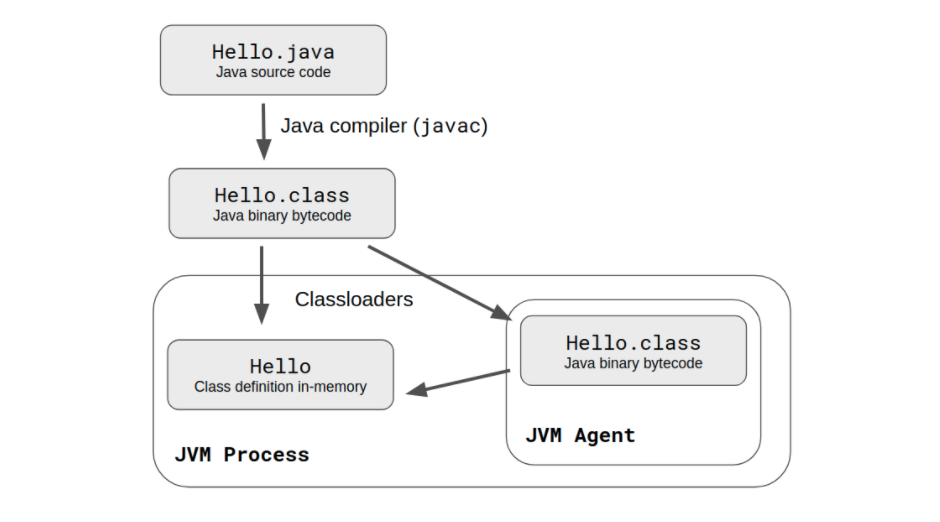

# Dynamic Analysis


In the previous sessions, we have looked at the source code, we have looked at version control, and we saw that useful information is available there that can help us with Architecture Recovery. 

The pattern for using this information in Architecture Recovery has been the same each time: **extract low-level information** (dependencies, commits, authors) and **abstract it up** into architecturally meaningful views. Today we continue that arc with a new question: *what low-level information can we extract at runtime from a given system?*

## Why we need to look at the running system — limitations of static analysis

### **Overestimates some relationships** 

The static call graph treats every potential edge as a real one. Many never fire:

- **Runtime polymorphism / DI** — from the source one can't know which of many alternative implementations is actually wired in (often decided at container startup).
- **Feature flags and config gates** — code behind `if (FEATURE_X)` looks reachable, but is effectively dead in any deployment where the flag is off.
- **Callbacks and strategy patterns** — `sort(list, my_comparator)` shows the call to `sort`; the edge `sort → my_comparator` is a runtime value.
- **Conditional branches in general** — even ordinary `if/else`: static treats both as live; any one execution takes one of them.

Dynamic analysis prunes this down to what actually runs.

### **Some information is only really available at runtime**

- **Dynamic code evaluation** — `eval(...)`, `new Function(string)` in JS, SQL strings constructed at runtime. The code being executed doesn't exist in any source file.
- **Code dependent on user-driven input** — `getattr(obj, request['field'])` invokes a method whose *name* comes from a request; the static analyzer doesn't even know which method is called.
- **Reflection** — `Class.forName(name).newInstance()` in Java, ORM-driven object instantiation, DI containers wiring components by string name. The static graph sees "something is reflected"; it can't see *what*.

### Cannot provide information about execution properties

Properties that can be architecturally relevant besides dependencies:

- **Memory consumption** — heap shape, allocation rates, leaks
- **Running times** — latency per call, p99 tail behavior
- **Frequency / hotness** — which methods are called millions of times, which are never called; tells you the *real* boundaries of the running system, not the source-code one
- **Concurrency behavior** — thread counts, lock contention, deadlocks; only visible under load
- **I/O and external calls** — DB queries, calls to other services, retry patterns; essentially your C&C-view edges observed in production

### Scenario: You want to run a dead code detection analysis 

Let us assume that we want to discover whether a given system has dead code -- code that is never actually used. This happens quite often actually. 

- How would you do this with static analysis? 
- What are the limitations of static analysis in this particular problem? 

*(Hold this question — we'll close it near the end of the lecture, once we have the tools.)*

Who cares about dead code detection?
- last week's guest
- big banks with offices distributed across 
- many companies who's architecture has drifted over many years


## What is dynamic analysis?

Dynamic analysis is a **technique of program analysis** that consists of **observing the behavior** of a program while it is executing. 

It collects **execution traces** — records of the sequence of actions that happened during an execution.

## Recording the execution of systems is expensive

Observing a running system is one thing; **recording** what we observe — so we can analyze it later, replay it, aggregate across runs, or query it — is another. And recording, at any meaningful scale, is expensive.

A few data points from research and industry:

### Google itself cannot afford to trace all of Google

**Google Dapper** (Sigelman et al., 2010) — Google's distributed tracing infrastructure samples roughly **1 in 1000 requests**, because tracing every request across the fleet would overwhelm storage and write throughput. ([paper](https://research.google/pubs/dapper-a-large-scale-distributed-systems-tracing-infrastructure/))

### Even rr, engineered for production deployability, costs ~1.5× and MB/sec

**Mozilla rr** (O'Callahan et al., USENIX ATC 2017) — a **deterministic record-and-replay engine** built so Firefox engineers could capture intermittent bugs *once* and then replay them forever in gdb (time-travel debugging). Even with this much engineering for low overhead, recording produces **several MB/sec of trace data** and imposes a **~1.5–1.8× slowdown** on typical workloads (**~8×** on fork-heavy workloads like `make`). ([paper](https://www.usenix.org/system/files/conference/atc17/atc17-o_callahan.pdf))

### Recording every Java assignment: ~10× slowdown, up to 300× on hot loops

**Omniscient Debugging** (Bil Lewis, 2003) — the foundational "record everything" debugger for Java.  ([paper](https://arxiv.org/pdf/cs/0310016))
- Records every assignment and method call; 
- Reported slowdown is **~7–10× on realistic Java applications** (Ant 7×, ODB display 10×) and 
- Up to **~300× on tight numeric loops**. 

### Time-travel debugging: 10–20× slowdown, only viable with cloud post-processing

**Microsoft Time-Travel Debugging / Pernosco** — modern time-travel debuggers. TTD recording slowdown is reportedly **10–20×**; Pernosco is only viable because it offloads post-processing to cloud-scale compute.

### The shared lesson: every dynamic analysis technique is a strategy for recording *less*

Full-fidelity recording is technically possible but economically prohibitive at any meaningful scale. Every dynamic analysis technique we'll discuss today is, in effect, a strategy for recording *less* — selectively, cheaply, and in a way that still answers an architectural question.

## Techniques: where we can hook in

There are multiple ways in which we can analyze a running system:

- Add *ad hoc* **logging** statements to the system
- ***Instrument*** the code automatically — at source, compile-time, bytecode, or binary level (more on these below)
- **Sample** the system's state periodically (profiling)
- Observe the system **from outside** — network traffic, OS-level events

Each of these techniques hooks into the running system at a *different layer*:

| Technique                                                       | Hooks into layer                                        |
| --------------------------------------------------------------- | ------------------------------------------------------- |
| **Logging** *(print, log4j, console.log)*                       | Source code                                             |
| **Instrumentation** *(decorators, Java agents, Pin / Valgrind)* | Source code **and** Build artifacts (bytecode / binary) |
| **Sampling / profiling** *(JFR, perf, py-spy)*                  | Runtime / VM                                            |
| **External observation** *(strace, eBPF, tcpdump)*              | Outside the process (OS, network)                       |

The further "down" we hook in, the less invasive — but also the harder it becomes to map what we see back onto the source-level constructs the architecture is described in.

The key activity in dynamic analysis is **instrumenting the system** — modifying it such that we can extract information from its execution. We'll go into depth on three techniques: **logging**, **reflection** (automatic instrumentation at the source level), and **runtime instrumentation** (bytecode rewriting via Java agents). The two outer layers — sampling/profiling and external observation — we'll only mention briefly as pointers.

### Logging 

Adding log statements in the program can help collect traces of its execution.

#### Benefits

The benefits of this approach are: 
##### Allows surgical precision 

We can add log statements only where relevant (e.g. if I want to investigate the calls between two particular classes, you can add log statements only in those classes. 

You can log the endpoints that are being called in your API, so you know which are used and which are not. 

##### Technology is straightforward to use

It's even too much to call it technology :) You use `console.log()`, `print()`, `logging.log()`, etc.

#### Limitations

##### Invasive 

Implies changing the program and adding log statements everywhere. 

Usually we want to log extensively so there is a lot of manual work needed. 

##### Tracking logs in distributed systems is challenging

Why do we care about distributed systems? Because everybody and their dog jumped on micro-services. 

The solution for logging in the context of a distributed system is a combination of techniques listed below:

###### Centralized logging

Logging for distributed systems, e.g. services and micro-services, requires the collection all the logs in one place. 


###### Tracing the sequence of messages

**The simplest way to tracking logs in a distributed system is to add timestamps in every logging statement.** The limitation of this approach can be hit at limits when the nodes in the system have their clocks desynchronized. 

**The precise approach is tracking requests as they propagate through multiple nodes in the system.** This more involved approach is called **distributed tracing** - tracking requests as they propagate through multiple microservices by adding a unique request ID or trace ID to every message

### Reflection

What if we could modify every method call to log itself, automatically? Adding a log statement to every method by hand doesn't scale. We can instead **modify the program at runtime** to make it record its own execution — automatic instrumentation at the source-code layer, using the language's own metaprogramming features.

#### **Reflection** is the ability of a program to manipulate as data something representing the state of the program during its own execution

In some languages it's easier to do (e.g. Ruby, Python) than in others (Java). 

There are two kinds of reflection:

##### 1: **Introspection** is the ability for a program to observe and therefore reason about its own state. 

E.g. listing the methods in a class in Python

- Every class has a `__dict__` that is a dictionary mapping the names of it's attributes to the objects that represent it (e.g. `Exception.__dict__.items()`)
- A method can be detected because it has the `__call__` attribute (e.g. `hasattr(object, '__call__'))

Putting the two together, we can define:
```Python
def methods_in_class(cls):
	return [
		(name, object) 
		for (name, object) 
			in cls.__dict__.items() 
		if hasattr(object, '__call__')]
```


##### 2: **Intercession** is the ability for a program to modify its own execution state or alter its own interpretation or meaning. 

E.g. replacing all the methods in a class with decorators that print call information before executing the original behavior in Python can be done in a few steps:


**Step 1: Define a decorator function.** That decorator could simply log the function call before delegating to the function, e.g. 
```Python
def log_decorator( function ):
	def decorated( *args, **kwargs ):
		print (f'I have been called: {function}')
		return function ( *args,**kwargs )
	return decorated
```

**Step 2: Define a function to decorate all the methods in a class.** This can be done by reusing our `methods_in_class` function from above: 
```Python
def decorate_methods( cls, decorator ):
	methods = methods_in_class(cls)
	for name, method in methods:
		setattr( cls, name, decorator ( method ))
```

**Step 3: Do the actual decoration.** First on a toy class to see what happens:

```python
class Foo:
    def __init__(self):
        self.x = 'foo'
    def do(self):
        print(self.x)

decorate_methods(Foo, log_decorator)
Foo().do()
```

Output:

```
I have been called: <function Foo.__init__ at 0x...>
I have been called: <function Foo.do at 0x...>
foo
```

If `Foo` held a reference to another wrapped object (a `Bar` whose `do()` calls `Foo.do()`), you'd see the full call chain in the trace — that's how this scales into a dynamic call graph.

The same trick on a real-system class — Zeeguu's `User` model:

```python
from zeeguu.core.model import User
decorate_methods(User, log_decorator)

u = User.find_by_id(534)
u.bookmark_count()

# to see even further one can instrument also third party libraries!
from sqlalchemy.orm.query import Query
decorate_methods(Query, log_decorator)
```
**Step #4: Using introspection to detect the calling site.** In the example above we used introspection to figure out the methods in a class. We can also use introspection to query the current state of the Python call stack with the help of the `inspect` package. 

```python
import inspect

def caller(): 
	callee()

def callee():
	print(inspect.stack()[1].function)

caller()
```
**Challenge**: can you plug this solution in the `log_decorator` for a more complete execution trace?


#### Function Wrappers

In the previous section, the `log_decorator` is what is called a **function wrapper** == a pattern inspired from the Decorator design pattern:

- A function *wraps* another function in order to ... 

	- perform some *prologue* and *epilogue* tasks, or to

	- optimize (e.g. cache results )

- ... while the *wrapper* is *fully* compatible with the wrapped function so it can be used instead

##### Advantages of Wrappers

- make it **easy to automate** (e.g. you could iterate through all the modules and all the classes in Zeeguu using reflection, and deploy a wrapper on every function)

##### Disadvantages of Wrappers
- they introduce an **overhead** (but then, so do all code instrumentation techniques)
- they require to be deployed on **live** objects 
- must be in the same process as the instrumented code

##### Application of Function Wrappers

FMD: a performance monitor implemented at ITU across several BSc and MSc theses: 

https://github.com/flask-dashboard/Flask-MonitoringDashboard


### Runtime Instrumentation

Reflection works at the source level — and is therefore language-specific. Runtime bytecode instrumentation works one layer down: it modifies the compiled output before it executes, which makes it language-agnostic within a given runtime (e.g. anything that compiles to JVM bytecode).

#### RT is a technique that modifies the generated code representation in order to avoid modifying the actual code.

Example: instrumenting the bytecode of Java programs can be done with a tool called the Java Agent. This is possible because:

- Java programs are compiled into bytecode
- Bytecode is executed on the JVM
- *Instrumenter* provides a Java Agent (via command line argument -javaagent) that modifieds the bytecode before it being executed

  
   

Advantage: 
- JVM bytecode instrumentation works for multiple languages

 


## Running the instrumented system

### Running the code itself might pose challenges 

- Configuration

- Dependencies

- Unwritten rules

- Some systems don't have a clear entry point (e.g. libraries)

Helpful practices that make running code easier: 

- continuous integration
- containerization
- infrastructure as code

### Which scenarios to run from the system?

- Run the unit tests if they exist
- Exercise individual "features"

> A feature is a realized functional requirement of a system. [...] an observable unit of behavior of a system triggered by the user [Eisenbarth et al., 2003].

  
## Limitations of dynamic analysis

### Limited by execution coverage

> Dynamic analysis is **related to testing and shares the same disadvantages**. 


> All the conclusions you draw are valid only with respect to the given input. When it comes to architecture, however, we are generally interested in all possible behavior. (Koshcke, ***What architects should know about reverse engineering and reengineering*** )

A program does not reach an execution point... => no data (e.g. Word but user never uses the print option)

### Can slow down the application considerably

Do you know how many function calls are in a second? Imagine duplicating them because of the print statements. And writing to file after each. That's going to slow down painfully your application! 

### Can result in a large amount of data 
A few seconds of execution can result in GB of data for complex systems


## Dynamic analysis for architecture recovery

Dynamic analysis is an essential **complement for static analysis**  for dependency extraction. 

The information extracted from dynamic analysis **can be aggregated** along the same axes as static.

One can do cross-language dependency extraction with the help of dynamic analysis. *Can you think of examples and how would you do this?*

### Static for Module Views, Dynamic for C&C Views?

A useful framing to connect Weeks 2 and 3:

- **Module views** describe code-time structure (classes, packages, "uses", layers). These exist in the source whether or not the system runs → **static analysis** is the natural tool.
- **C&C views** describe runtime instance topology (processes, services, threads; connectors like RPC, pub-sub, HTTP). Components have *identity* only at runtime — one class can instantiate many components → **dynamic analysis** is the natural tool.

> Static analysis tells you the **space of possibilities**.
> Dynamic analysis tells you the **actuality of one execution**.
> Module views mostly live in the first; C&C views mostly live in the second.

This is a default heuristic, not a clean partition. The interesting cases are where it breaks down:

- **Static can seed C&C views** — docker-compose, Spring wiring, IaC, Kafka topic declarations often declare microservice topology without running anything.
- **Dynamic refines module views** — and here we close the **dead-code scenario** we opened with. Execution data prunes the static "uses" graph in *both* directions: it **rescues** code that *looks* dead but is called at runtime (via reflection, tests, tools), and **flags** code that *looks* alive in the call graph but is never actually called.
- **DI / runtime polymorphism** blurs both: the module view shows interface + implementations; *which* implementation is actually wired is a C&C fact resolved at container startup.


## Challenges for you

### Extract dynamic dependencies from your case study system

Run the system under instrumentation, capture the actual call sequence, and lift it into a **dependency graph** at module (or class) granularity. Compare against the static dependency graph from the previous sessions: which edges does only static see? Which does only dynamic see?

### Implement a Code Coverage viewpoint

For every class, compute the **ratio of methods called by the unit tests** to the total number of methods, then aggregate to module level. The result is a viewpoint that highlights under-tested parts of the architecture — and doubles as a partial dead-code detector.

 

## Bibliography

1. [What architects should know about reverse engineering and reengineering](https://citeseerx.ist.psu.edu/document?repid=rep1&type=pdf&doi=05981602215076b7492b87a8a1f7157dcc9c2196) R. Koschke, In 5th Working IEEE/IFIP Conference on Software Architecture (WICSA'05)_(pp. 4-10). IEEE.
2. Function Wrappers: https://wiki.python.org/moin/FunctionWrappers
3. Wrappers to the Rescue: http://citeseerx.ist.psu.edu/viewdoc/download?doi=10.1.1.18.6550&rep=rep1&type=pdf

## 

